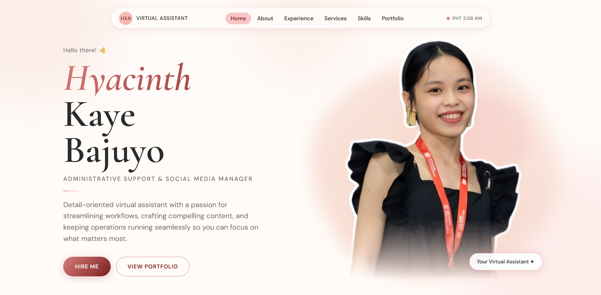
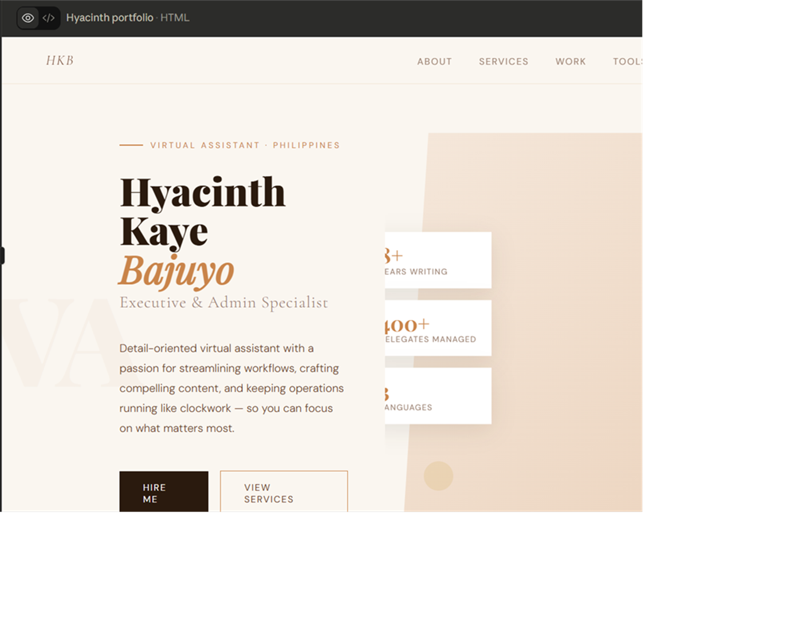
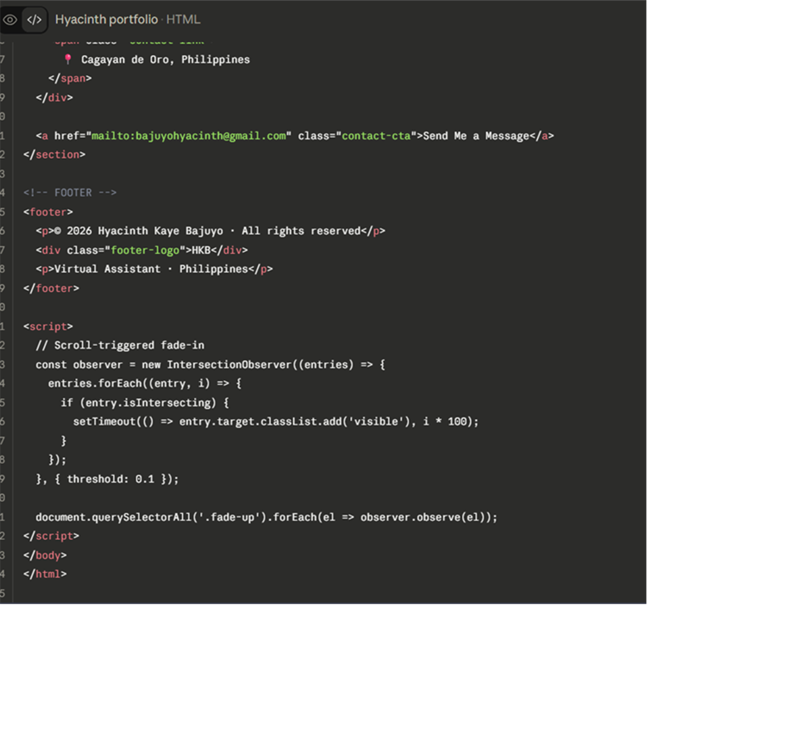
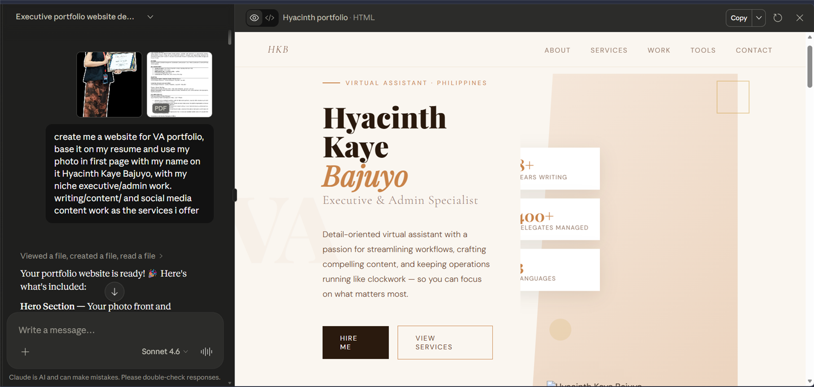
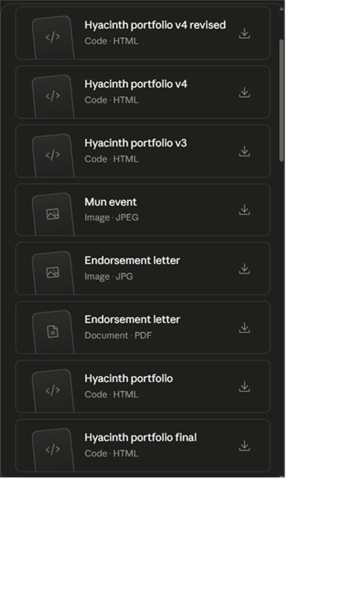
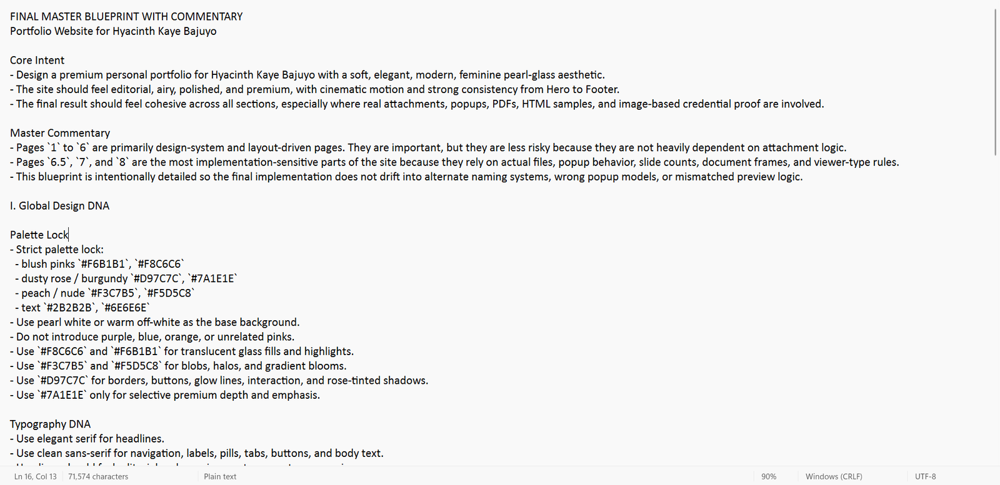

# Before Versions / Final Blueprint

## Final Website Hero

The live portfolio opens with the final hero page after the site was refined into a polished VA portfolio.

## Before Versions

The first versions show the raw AI-generated preview, the early one-page HTML code, the prompt context, and the saved AI file history before the final master blueprint became the build direction.

## Final Master Blueprint

The final blueprint served as the after-direction: a complete design and implementation guide for visual style, layout tokens, navigation behavior, motion, accessibility, and responsive rules.

## Key Revisions

- Converted the one-page draft into a structured project with separate `index.html`, `styles.css`, and `scripts.js` files.
- Organized sample images into named asset folders by category.
- Refined the services section to use virtual assistant keywords and client-facing language.
- Cleaned the footer and contact details for a more professional close.
- Improved sample popups with readable JPG stacks, tabbed categories, and cleaner descriptions.
- Added GitHub Pages-ready documentation and repository structure.
