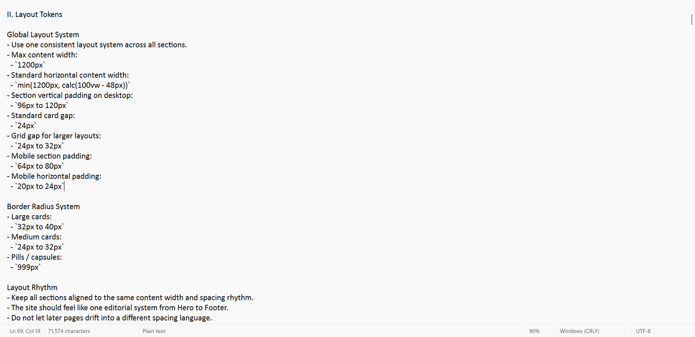
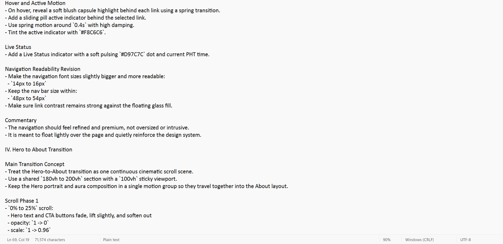
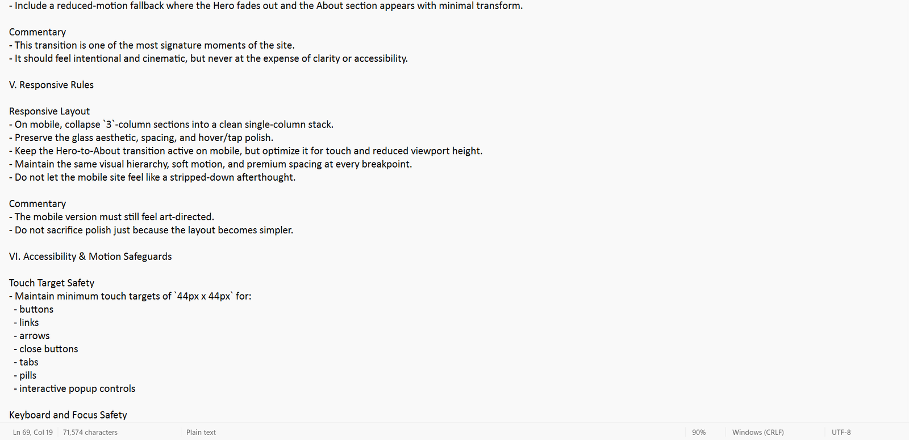
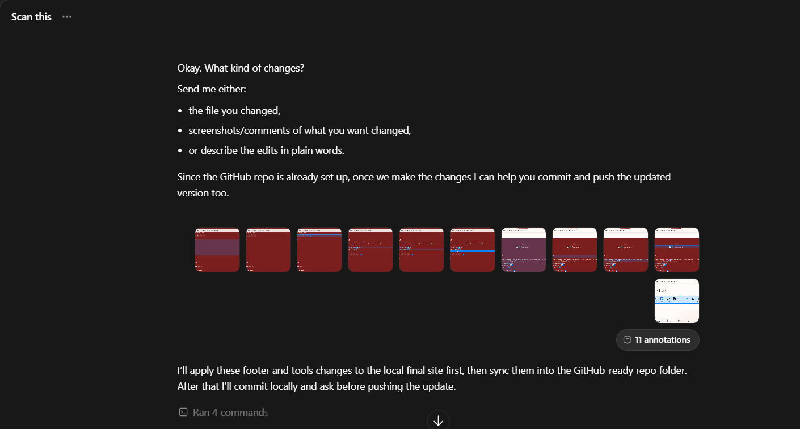
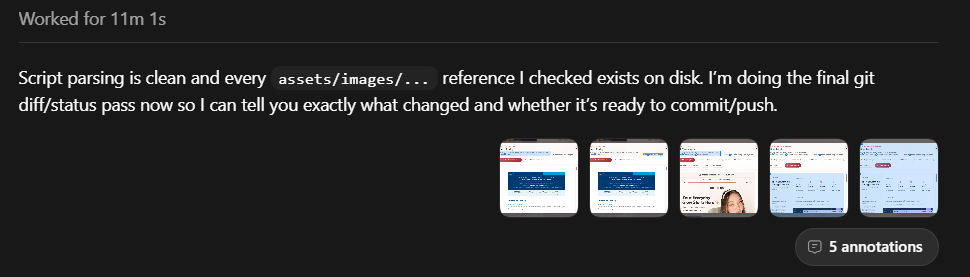
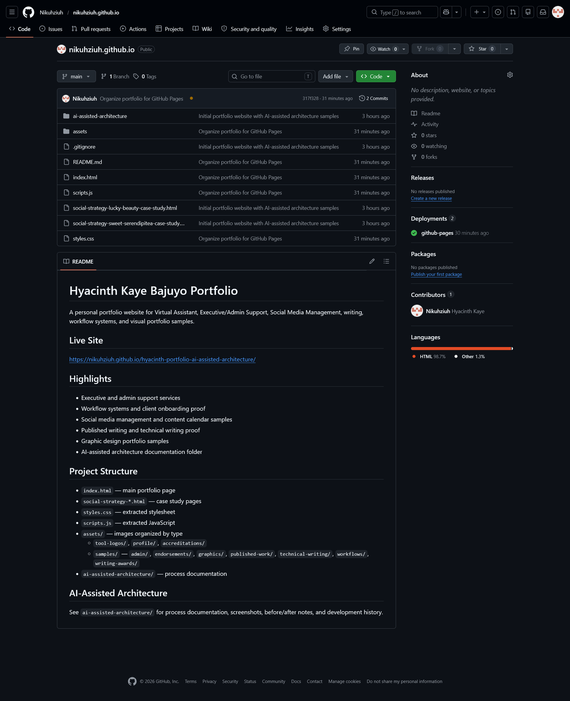

# AI Direction Log

This is a short process record showing how AI support was directed during the portfolio build.

## Initial Build Direction

The project started with a prompt asking AI to create a VA portfolio website using the resume, profile image, and service focus areas: executive/admin work, writing/content, and social media content support.

## Blueprint Direction

The master blueprint defined the visual and technical rules for the final site, including palette, typography, layout rhythm, navigation, motion, accessibility, and responsive behavior.

## Revision Direction

The revision phase used direct annotation-style feedback to improve the site section by section. Changes included service wording, footer cleanup, tool logo sizing, sample popup behavior, technical writing descriptions, and the order of admin sample tabs.

## Final Execution

The final stage organized files for GitHub Pages, checked asset references, and prepared a professional repository structure with documentation and sample evidence.

